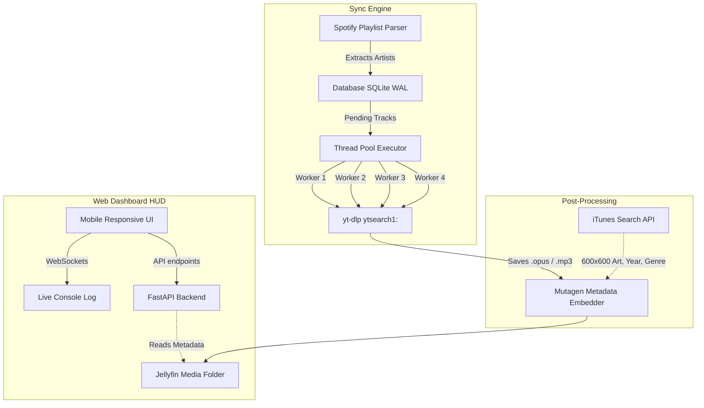

# Musicadet

Self-hosted intelligent music aggregator and synchronization pipeline with a premium, mobile-responsive web dashboard (HUD).

> [!TIP]
> Musicadet completely automates the process of discovering artists, cataloging albums into SQLite, and downloading high-quality discographies (`.opus` or `.mp3`) directly from YouTube Music using a robust, multi-threaded `yt-dlp` engine.

## 🚀 Key Features

- **Multi-Threaded Downloader:** Unleashes up to 4 parallel workers to rip tracks blazing fast while keeping individual artist downloads sequential to gracefully bypass YouTube's anti-bot rate limits.
- **Intelligent Metadata Injection:** Quietly pulls gorgeous **600x600 High-Res Cover Art**, Release Year, and Genre directly from the *iTunes Search API* and permanently embeds them natively into your `.opus` or `.mp3` files via the `mutagen` engine.
- **Zero Database Locks:** Fully fortified SQLite backend running in `WAL` mode with robust 60-second wait-queues ensures rock-solid stability during aggressive concurrent downloading.
- **Premium Web Dashboard:** A sleek, dark-mode, mobile-responsive interface featuring single-row navigation, live WebSockets console, pagination, and a beautiful floating Modal to inspect real-time embedded file metadata.
- **Album Completeness Engine:** Automatically detects if an artist is missing tracks from an album and gracefully fills in the gaps.

---

## 🏗 Architecture Schema



---

## ⚙️ Install / Update

Run this one-liner as root to clone/update the repository, install dependencies, and register the global `musicadet` CLI and `systemd` services:

```bash
bash <(curl -fsSL https://raw.githubusercontent.com/Mausica/musicadet.web/main/install.sh)
```

## 📱 HUD Web Dashboard

Access the beautiful dashboard from any device: **http://SERVER_IP:8800**

- **Dashboard:** At-a-glance metrics for your entire library.
- **Library & Artists:** Fully paginated exploration of your downloaded catalog.
- **Files:** Explore the physical disk files, and click **Info** to instantly inspect their embedded High-Res Cover Art, Year, Bitrate, and Genre in a sleek pop-up Modal.
- **Console:** Watch the 4-worker thread pool rip your tracks in real-time via WebSockets.
- **Settings:** Configure your output formats (`opus` or `mp3`), Jellyfin folder paths, and more.

## 💻 Global CLI

The `musicadet` command is available from anywhere on your server:

```bash
musicadet                              # Full sync (playlists → scan albums → download)
musicadet scan                         # Discover new artists from configured playlists
musicadet scan-artists                 # Scan artist albums into the database
musicadet scan-artists --new-only      # Only scan newly discovered artists
musicadet artists-sync                 # Download all pending tracks sequentially
musicadet download-pending             # Trigger the fast multi-threaded downloader
musicadet reconcile                    # Re-map physical files ↔ database
musicadet fix-metadata                 # Re-fetch and embed iTunes covers & tags
musicadet add "Artist Name"            # Manually force-add an artist
```

## 🛠 Configuration

Located at `/opt/musicadet/config.json` (also editable via the Settings tab in the HUD):

| Key | Default | Description |
|-----|---------|-------------|
| `music_dir` | `/mnt/storage_jellyfin/media/music` | Download root folder for Jellyfin |
| `format` | `opus` | Preferred audio format (`opus` or `mp3`) |
| `bitrate` | `320k` | Audio quality |
| `output_template` | `{artist}/{album}/{track:02d} - {title}.{ext}` | Clean physical folder layout |
| `threads` | `4` | Number of concurrent `yt-dlp` download workers |
| `hud_port` | `8800` | Port for the web interface |

## 🔄 Systemd Services

Musicadet is fully integrated with `systemd` for seamless background operation:

```bash
systemctl status musicadet.timer       # Daily automated synchronization
systemctl start musicadet.service      # Trigger an immediate background sync
systemctl status musicadet-hud.service # Background daemon for the Web UI
journalctl -u musicadet-hud.service -f # Watch the Web UI logs
```
