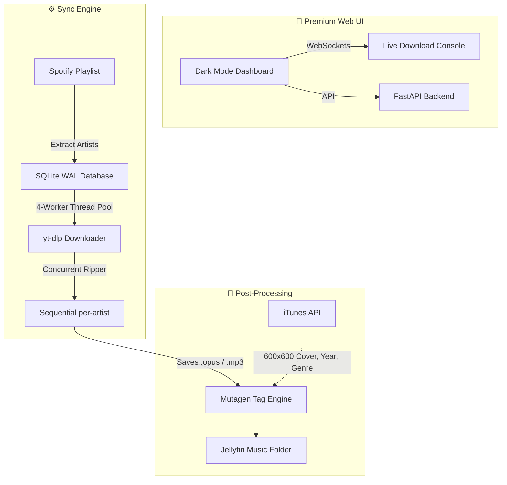

# Musicadet 🎵

A fully automated, self-hosted music aggregator. It discovers artists from Spotify, rips their discographies from YouTube Music at blazing speeds, and injects beautiful high-res metadata. 

---

## 🏗 How It Works



---

## 🚀 One-Line Install

```bash
bash <(curl -fsSL https://raw.githubusercontent.com/Mausica/musicadet.web/main/install.sh)
```

## ✨ Highlights

* **Blazing Fast:** 4 concurrent `yt-dlp` background workers.
* **Smart Metadata:** Automatically embeds gorgeous **600x600 iTunes Cover Art**, Release Year, and Genre directly into your files.
* **Bulletproof Database:** SQLite runs in `WAL` mode with 60-second timeouts — zero database locks.
* **Instant Inspection:** Click **Info** on any file in the Web UI to see its embedded cover and metadata in a sleek modal!

## 📱 Web Dashboard (`http://SERVER_IP:8800`)

* **Library & Artists:** Browse your entire downloaded catalog.
* **Files:** Inspect physical disk files and their embedded tags.
* **Console:** Watch the 4-worker thread pool rip tracks in real-time.
* **Settings:** Configure Jellyfin paths, preferred format (`opus` or `mp3`), and bitrate.

## 💻 CLI Commands

```bash
musicadet                              # Run a full automated sync
musicadet download-pending             # Trigger the 4-worker downloader
musicadet prune-caps                   # Delete extra tracks (keeps top-viewed per artist limit)
musicadet cookies-check                # Verify YouTube cookies on the server
musicadet fix-metadata                 # Re-fetch covers & tags from iTunes
musicadet add "Artist Name"            # Force-add an artist
```

### YouTube cookies (via GitHub — easiest if you already deploy with `git pull`)

**Use a private repository only.** The cookies file is a login key; anyone with it can use your YouTube account.

1. On your **PC**, install **Get cookies.txt LOCALLY** and export cookies while on youtube.com.
2. Save the export as `sync-data/youtube-cookies.txt` inside this project (next to `youtube-cookies.txt.example`).
3. Commit and push:

   ```bash
   git add sync-data/youtube-cookies.txt
   git commit -m "Update YouTube cookies"
   git push
   ```

4. On the **server**, pull and test:

   ```bash
   cd /path/to/musicadet.web
   git pull
   musicadet cookies-check
   ```

No `config.json` change needed — the app checks `sync-data/youtube-cookies.txt` in the repo after pull.

Cookies expire every few weeks — repeat steps 1–4.

**Alternative:** `scp` to `/opt/musicadet/sync-data/youtube-cookies.txt` if you prefer not to store cookies in git.
